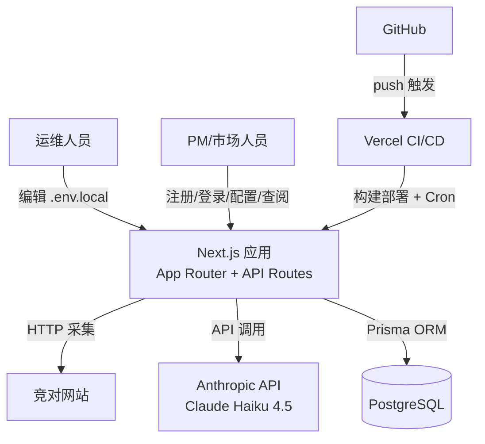

> 目的：产出可评审的**决策文档（RFC）**，作为 implementation 的权威输入。不写"待确认问题/TODO"；未知统一进入第 6 节风险与验证清单。

## 0. 基本信息

- 需求标识（分支 / ID）：`001-competitor-tracking`
- 标题：竞争情报监控系统 MVP v3 — Next.js 单体架构设计 RFC
- 作者：开发团队
- 评审人：开发 + 运维 + PM
- 状态：draft
- 最后更新：2026-07-08
- 关联链接：`requirements/solution.md`、`requirements/prd.md`

---

## 1. 结论摘要（v3：Next.js 单体架构）

- **目标**：构建自动化竞争情报监控系统，替代人工浏览/截图/比对的低效工作流
- **In / Out**：In = 用户注册/登录（JWT 鉴权）+ PostgreSQL 统一存储（用户账号 + 竞对配置 + 采集快照）+ Vercel Cron 定时采集 + Claude Haiku 4.5 语义解读 + 历史记录查看（按 user_id 隔离）；Out = 忘记密码/邮件重置、第三方 OAuth、多角色权限、实时告警、社媒抓取
- **推荐方案**：Next.js 15 App Router 单体应用——前端页面 + API Routes + 业务逻辑全部在同一 Next.js 项目中，Prisma ORM 连接 PostgreSQL，部署到 Vercel，Vercel Cron Jobs 驱动定时采集
- **关键取舍**：v2 Python FastAPI + Next.js 分离架构因需维护两套运行时（Python VPS + Vercel）而被废弃；Next.js 单体消除了跨域 CORS 复杂度，减少运维负担；APScheduler 替换为 Vercel Cron Jobs，无需常驻进程
- **优先验证点**：V-001（Haiku 4.5 解读质量）、V-002（定时采集稳定性 >90%）

---

## 2. 范围与边界

- **系统边界**：单一 Next.js 项目（根目录），包含 `app/`（页面 + API Routes）、`lib/`（业务逻辑）、`prisma/`（数据模型）；无独立后端进程
- **影响面**：
  - 上游：`.env.local`（`DATABASE_URL`、`JWT_SECRET`、`AI_API_KEY`、`CRON_SECRET`）由运维管理
  - 下游：页面直接调用同域 API Routes，无跨域问题
  - 新增：根目录 Next.js 项目（替代原 `backend/` Python 服务 + `demo/` React 原型）
- **明确不做**：忘记密码/邮件重置、多角色权限、第三方 OAuth、Slack/邮件推送、社媒抓取、多模型路由、代理池
- **不变量**：
  - 密码只存 bcrypt hash（cost factor 12），不落盘明文、不出现在日志
  - 竞对配置与历史记录均按 `userId` 隔离，跨用户访问返回 HTTP 403/404
  - HTML diff 为空时不调用 LLM、不写入新记录
  - LLM 调用失败时写入记录但 summary 标记为 `"[AI 解读失败，原因: {error}]"`，不丢失采集快照
  - 同一竞对 URL 的采集 `Promise.allSettled` 并发，单个失败不影响其他

---

## 3. 推荐方案（C4 L1–L3）

### 3.1 C4-L1：System Context

- **用户/角色**：内部 PM/市场人员（注册/登录后查阅竞对历史）、运维人员（`.env.local` 全局配置管理）
- **外部系统**：
  - 目标竞对网站（HTTP 采集源）
  - Anthropic API（Claude Haiku 4.5 语义解读）
  - Vercel（应用托管、CI/CD、Cron Jobs）
  - GitHub（代码仓库）
  - PostgreSQL 数据库（Supabase / 自托管）
- **系统边界**：单一 Next.js 应用，页面与 API 同域，无跨服务通信
- **关键交互**：用户注册/登录获取 JWT（httpOnly cookie）→ 自助配置竞对 → Vercel Cron 每小时触发 `/api/cron/collect` → 采集 + LLM 解读 → MySQL 存储 → 前端查询历史



### 3.2 C4-L2：Container

| 容器 | 职责 | 技术选型 | 运行位置 |
|---|---|---|---|
| Next.js App | 前端页面 + API Routes + 业务逻辑 | Next.js 15, React 19, Tailwind CSS, TypeScript | Vercel Serverless Functions |
| PostgreSQL 数据库 | 用户账号 + 竞对配置 + 采集快照统一存储 | PostgreSQL 15，Prisma ORM | Supabase / 自托管 VPS |
| Vercel Cron | 定时触发采集任务 | Vercel Cron Jobs（`vercel.json`），每小时执行 | Vercel 托管 |

**关键数据流**：
1. 用户注册/登录 → `POST /api/auth/register` / `POST /api/auth/login` → 返回 access_token（24h）+ refresh_token（7d，httpOnly cookie）
2. 登录用户配置竞对 → `POST/GET/PUT/DELETE /api/competitors` → 写入 PostgreSQL competitors 表（关联 userId）
3. Vercel Cron 触发 → `GET /api/cron/collect`（Bearer CRON_SECRET）→ `lib/collect.ts` 汇总竞对 → 采集 HTML → diff → 有变化则调用 LLM → 写入 PostgreSQL snapshots 表
4. 前端查询 → `GET /api/competitors`（按 userId 过滤）→ `GET /api/snapshots?competitor_id=...`（按 th/refresh`（公开，无需 token）
- `GET/POST/PUT/DELETE /api/competitors`（需 JWT，middleware 注入 `x-user-id`）
- `GET /api/snapshots`、`GET /api/snapshots/{id}`（需 JWT，middleware 注入 `x-user-id`）
- `GET /api/cron/collectre.ts` | Edge 层 JWT 验证；向受保护 API 注入 `x-user-id` header | jose `jwtVerify`，matcher: `/api/competitors/**`、`/api/snapshots/**` |
| `lib/db.ts` | Prisma Client 单例（开发环境热重载安全） | `@prisma/client`，`globalThis` 缓存 |
| `lib/auth.ts` | JWT 签发/验证（jose HS256）；bcrypt 密码 hash/验证；cookie 配置 | jose, bcryptjs factor 12，`JWT_SECRET`（≥64 bytes hex） |
| `lib/scraper.ts` | axios+cheerio 主采集 + Playwright JS fallback；UA 轮换 + 域名级随机延迟（10-30s）；tenacity 风格重试 | axios, cheerio, playwright（dynamic import） |
| `lib/llm.ts` | Anthropic SDK 调用；输入 URL + diff，输出 JSON（change_type/summary/importance）；API 失败降级 | @anthropic-ai/sdk，`AI_API_KEY` from `.env.local` |
| `lib/collect.ts` | 遍历所有竞对；调用 scraper + diff + llm；`Promise.allSettled` 并发，单失败不影响全局 | `prisma`，`fetchHtml`，`diffHtml`，`analyzeChange` |
| `app/api/auth/*` | 注册/登录/刷新/退出/当前用户（公开路由，不过 middleware） | `lib/auth.ts`，`lib/db.ts` |
| `app/api/competitors/*` | 竞对 CRUD，`userId` 隔离 | `lib/db.ts`，`getUserIdFromRequest` |
| `app/api/snapshots/*` | 快照查询（列表 + 详情），`userId` 隔离 | `lib/db.ts`，`getUserIdFromRequest` |
| `app/api/cron/collect` | 定时采集入口，Bearer CRON_SECRET 鉴权 | `lib/collect.ts` |

**数据模型（Prisma schema）**：

```
User:       id, username, email, passwordHash, createdAt
Competitor: id, userId(FK->User), name, websiteUrl, industry, notes, createdAt
            @@unique([websiteUrl, userId])
Snapshot:   id, competitorId(FK->Competitor), userId(FK->User),
            crawledAt, htmlContent, changeType, summary, importance
```

**采集任务状态流转**：

```
Vercel Cron → GET /api/cron/collect → lib/collect.ts collectAll()
  ↓
Promise.allSettled(competitors.map(collectCompetitor))
  ↓
fetchHtml（axios+cheerio，Playwright fallback，最多 3 次重试）
  ↓
与 snapshots 表最新记录 htmlContent 对比 diffHtml()
  ↓
无变化 → 不写库，不调用 LLM
有变化 → analyzeChange(url, diff)
         ↓
    LLM 成功 → 写入 snapshot（changeType/summary/importance 非空）
    LLM 失败 → 写入 snapshot，summary = "[AI 解读失败，原因: {error}]"
```

### 3.4 关键决策与取舍

| # | 决策点 | 选择 | 取舍理由 |
|---|---|---|---|
| D1 | LLM 选型 | Claude Haiku 4.5 via @anthropic-ai/sdk | 成本最低，结构化输出原生支持；V-001 不达标 → 升级至 Sonnet 4.6 |
| D2 | 存储选型 | MySQL 8.x + Prisma ORM | 多用户 `WHERE userId=X ORDER BY crawledAt DESC` 索引支持；Prisma 迁移工具成熟；替代 SQLite（不支持 Vercel 部署） |
| D3 | 架构模式 | Next.js 单体（App Router + API Routes） | 消除跨域 CORS；无需维护独立 Python 后端进程；Vercel 一键部署 |
| D4 | 鉴权机制 | JWT HS256 无状态（jose），httpOnly cookie 存储 | OWASP 禁止 localStorage 存储会话凭证；Edge middleware 验证性能好 |
| D5 | 密码 hash | bcryptjs factor 12 | OWASP 2024 推荐最低 factor 10；bcryptjs 纯 JS 实现兼容 Vercel Edge |
| D6 | 调度机制 | Vercel Cron Jobs（`vercel.json`）+ `/api/cron/collect` | 无需常驻进程；本地开发可手动 GET 触发；CRON_SECRET 鉴权防滥用 |
| D7 | 采集技术栈 | axios+cheerio + Playwright dynamic import fallback | axios+cheerio 轻量；Playwright 仅 SPA fallback，dynamic import 避免冷启动影响 |
| D8 | ORM | Prisma 5.x | 类型安全；迁移工具完整；与 Next.js 生态集成成熟 |

### 3.5 对外承诺要点

**REST API 契约（v3，按 userId 隔离）**：
- 认证接口（公开）：`POST /api/auth/register`、`POST /api/auth/login`、`POST /api/auth/refresh`、`POST /api/auth/logout`、`GET /api/auth/me`
- 竞对配置接口（需 JWT cookie/header）：`GET/POST /api/competitors`、`GET/PUT/DELETE /api/competitors/{id}`
- 快照查询接口（需 JWT cookie/header）：`GET /api/snapshots?competitor_id={id}&limit=20`、`GET /api/snapshots/{id}`
- Cron 接口（Bearer CRON_SECRET）：`GET /api/cron/collect`

**数据口径**：
- `changeType`：LLM 输出字符串（如 `"价格变动"/"产品更新"`）；MVP 不强校验枚举
- `importance`：LLM 输出字符串（`"低"/"中"/"高"`）
- `crawledAt`：ISO 8601 UTC 时间戳

---

## 4. 与现有系统的对齐

> `CONTEXT GAP`：项目无 `.aisdlc/project/` 知识库。以下基于代码事实与 `solution.md#impact-analysis`。

| 模块 | 影响类型 | 兼容性结论 |
|---|---|---|
| Python 后端（`backend/`）| 完全替代 | **废弃**：所有逻辑迁移至 Next.js API Routes + lib/；`backend/` 目录可删除 |
| React 原型（`demo/`）| 完全替代 | **废弃**：原型已完成其使命，Next.js App Router 页面替代 |
| MySQL 数据模型 | 延续 | **兼容**：表结构保持一致（users/competitors/snapshots），字段名从 snake_case 改为 camelCase（Prisma 惯例） |
| REST API 路径 | 调整 | v2 路径 `/auth/*`、`/api/*` → v3 路径 `/api/auth/*`、`/api/competitors`、`/api/snapshots`（Next.js 惯例，all under `/api/`） |

---

## 5. 影响分析

- **运行与运维**：无需维护 Python 进程；Vercel 自动扩缩容；MySQL 需独立部署（PlanetScale 或自托管）
- **数据口径**：Prisma camelCase 字段（`passwordHash`、`websiteUrl`、`crawledAt`）；API 响应 JSON 保持 camelCase
- **迁移**：v2 Python 后端直接替换，MySQL 数据模型一致，无数据迁移负担（内测期直接切换）
- **本地开发**：`npm run dev` 启动；`npm run db:push` 同步 schema；cron 任务通过 `curl -H "Authorization: Bearer $CRON_SECRET" http://localhost:3000/api/cron/collect` 手动触发

---

## 6. 风险与验证清单

| # | 风险/假设 | 验证方式 | 成功信号 | 失败信号 | 下一步动作 |
|---|---|---|---|---|---|
| V-001 | Haiku 4.5 对 HTML diff 语义解读质量达标 | 人工选 3–5 个已知有变化页面，对比 AI 输出与人工判断 | 80%+ 变化被正确识别，summary 有参考价值 | AI 频繁输出"无变化"或解读与实际不符 | 升级至 Sonnet 4.6 或调整 prompt |
| V-002 | 定时采集稳定性 >90% | 部署后 7 天连续运行，统计每竞对采集成功/失败次数 | 成功率 >90% | 成功率 <70% 或频繁 IP 封禁 | 引入代理池或降低 Cron 频率 |
| V-003 | Vercel Serverless 函数超时（Playwright 场景） | 测试含 JS 渲染目标网站的采集时长 | 在 60s 内完成（Vercel Pro 上限） | 函数超时 | 拆分采集为独立 Background Function 或降级跳过 Playwright |
| V-004 | JWT_SECRET 安全强度 | 代码审查确认 secret 来源（≥64 bytes hex）；httpOnly cookie 存储 | 审查通过，无高危发现 | secret 硬编码或强度不足 | 强制 httpOnly cookie + 重新生成 JWT_SECRET |
| V-005 | Vercel Cron 部署正常 | 首次部署后查看 Vercel Dashboard → Cron Jobs，验证每小时触发 | Cron 执行记录显示成功 | Cron 不触发或 401 | 检查 CRON_SECRET 与 vercel.json 配置 |

---

## 7. 追溯链接

- [`requirements/solution.md`](.aisdlc/specs/001-competitor-tracking/requirements/solution.md)
- [`requirements/prd.md`](.aisdlc/specs/001-competitor-tracking/requirements/prd.md)

---

## 8. 迭代记录

- 2026-07-07：v1 RFC 初版，JSON 文件存储，无用户系统
- 2026-07-08：v2 RFC，引入 JWT + SQLite WAL + FastAPI + Next.js 分离架构
- 2026-07-08：v3 RFC，技术栈切换为 Next.js 15 单体（App Router + Prisma + MySQL + Vercel Cron），废弃 Python 后端
