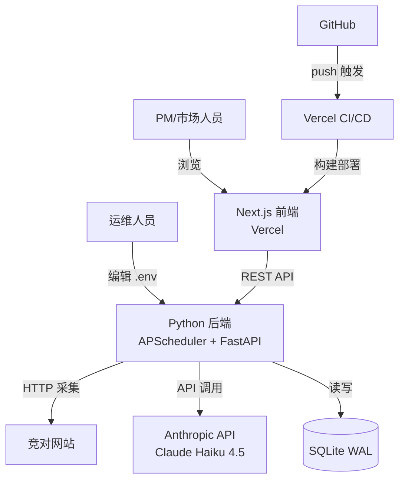

> 目的：产出可评审的**决策文档（RFC）**，作为 implementation 的权威输入。不写"待确认问题/TODO"；未知统一进入第 6 节风险与验证清单。

## 0. 基本信息

- 需求标识（分支 / ID）：`001-competitor-tracking`
- 标题：竞争情报监控系统 MVP v1 — 系统设计 RFC
- 作者：开发团队
- 评审人：开发 + 运维 + PM
- 状态：draft
- 最后更新：2026-07-07
- 关联链接：`requirements/solution.md`、`requirements/prd.md`、`design/research.md`

---

## 1. 结论摘要

- **目标**：构建自动化竞争情报监控系统，替代人工浏览/截图/比对的低效工作流
- **In / Out**：In = `.env` 竞对 URL 配置 + APScheduler 定时采集 + Claude Haiku 4.5 语义解读 + SQLite 历史存储 + Next.js/Vercel 前端展示；Out = 登录/鉴权、实时告警、社媒抓取、多角色权限
- **推荐方案**：Python 后端（APScheduler + FastAPI + SQLite WAL）独立运行，Next.js 前端部署到 Vercel，通过 REST API 连接；同一 GitHub 仓库，`backend/` + `frontend/` 双子目录结构
- **关键取舍**：Vercel 不支持常驻 Python 进程，故前后端必须网络分离（REST API）而非文件共享；SQLite WAL 满足单机写+多并发读，直到 50 万行或多实例需求出现前无需迁移 PostgreSQL
- **优先验证点**：V-001（Haiku 4.5 解读质量）、V-002（定时采集稳定性 >90%）

---

## 2. 范围与边界

- **系统边界**：新建独立服务，不修改现有 `index.html`/`styles.css`/`script.js` landing page 逻辑
- **影响面**：
  - 上游：`.env` 配置（MONITOR_URLS、MONITOR_INTERVAL、AI_API_KEY）由运维管理
  - 下游：Vercel 前端通过 `NEXT_PUBLIC_API_BASE_URL` 调用后端 REST API
  - 新增：`backend/`（Python 进程独立运行）、`frontend/`（Vercel 构建）、根目录 `vercel.json`
- **明确不做**：用户登录/鉴权/权限、Slack/邮件推送、社媒抓取、多模型路由、代理池（MVP Out）
- **不变量**：
  - 现有 landing page（`index.html`）保持不变，Vercel 根路由继续服务静态文件
  - SQLite 文件仅 Python 后端写入，前端只通过 REST API 读取（规则-5）
  - 同一 URL 的采集任务 `max_instances=1`，防止并发写入冲突（规则-4）

---

## 3. 推荐方案（C4 L1–L3）

### 3.1 C4-L1：System Context

- **用户/角色**：内部 PM/市场人员（前端查阅历史）、运维人员（`.env` 配置管理）
- **外部系统**：
  - 目标竞对网站（HTTP 采集源）
  - Anthropic API（Claude Haiku 4.5 语义解读）
  - Vercel（前端托管与 CI/CD）
  - GitHub（代码仓库与 Vercel 部署触发）
- **系统边界**：`myapp` 仓库内新增 `backend/`（Python 服务）和 `frontend/`（Next.js）；两者通过 REST API 连接
- **关键交互**：运维编辑 `.env` → 重启后端 → APScheduler 按间隔采集网站 → 调用 LLM 解读 → 存入 SQLite → Next.js 前端查询 FastAPI → 展示历史记录
- **关键约束**：Vercel 不支持常驻 Python 进程；SQLite 不支持跨机器访问；无鉴权（内部访问）



### 3.2 C4-L2：Container

| 容器 | 职责 | 技术选型 | 运行位置 |
|---|---|---|---|
| Python 后端 | 定时采集 + AI 解读 + REST API | Python 3.11+, APScheduler 3.x, FastAPI, SQLite WAL, Alembic | 本地/VPS（独立进程） |
| Next.js 前端 | 历史记录查阅 UI | Next.js 14+, React, Vercel | Vercel（GitHub push 自动部署） |
| SQLite 数据库 | 历史快照与 AI 解读存储 | SQLite（WAL 模式）, Alembic 迁移 | 与 Python 后端同机文件系统 |

**关键数据流**：
1. APScheduler 触发 → scraper 抓取 HTML → diff 与上次快照比较 → 有变化则调用 LLM → 写入 SQLite
2. 用户访问 Vercel 前端 → `GET /api/urls` 获取 URL 列表 → 选择 URL → `GET /api/snapshots?url=...` 获取历史 → 渲染列表与详情

**对外契约入口**：
- `GET /api/urls`：返回 MONITOR_URLS 列表
- `GET /api/snapshots?url={url}&limit=20`：查询某 URL 历史记录，按 `crawled_at` 倒序
- `GET /api/snapshots/{id}`：查询单条记录详情（含 AI 解读全文）

### 3.3 C4-L3：Component

**Python 后端组件**：

| 组件 | 职责 | 关键接口/依赖 |
|---|---|---|
| `main.py` | APScheduler 入口，加载 `.env`，启动调度与 FastAPI 同进程 | `uvicorn.run()` + `scheduler.start()` |
| `scraper.py` | requests+BS4 采集（主）+ Playwright fallback（JS 渲染检测）；UA 轮换 + 域名级随机延迟（10-30s） | `requests`, `beautifulsoup4`, `playwright` |
| `llm.py` | Anthropic SDK 调用；输入 HTML diff，输出结构化 JSON（change_type/summary/importance）；调用失败降级（summary 标记错误信息，不丢快照） | `anthropic` SDK, Pydantic 模型 |
| `models.py` | SQLAlchemy ORM 模型（snapshots 表：url, crawled_at, html_content, change_type, summary, importance）；`crawled_at` 索引 | `sqlalchemy`, `alembic` |
| `api.py` | FastAPI 路由；CORS 配置（允许 Vercel 域名）；只读接口 | `fastapi`, `sqlalchemy` session |
| `scheduler.py` | APScheduler job 定义；`max_instances=1`；tenacity 重试（指数退避，最多 3 次） | `apscheduler`, `tenacity` |

**关键状态流转**：

```
URL 采集任务触发
  ↓
scraper 抓取 HTML
  ↓（与上次快照比较）
无变化 → 不写库，不调用 LLM（规则-2）
有变化 → 调用 LLM
         ↓
    LLM 成功 → 写入完整记录（change_type/summary/importance 非空）
    LLM 失败 → 写入记录，summary = "[AI 解读失败，原因: {error}]"（规则-3）
```

**错误处理与幂等策略**：
- 采集超时（>30s）：tenacity 指数退避，最多 3 次重试，耗尽后写日志，不中断其他 URL 同批次采集
- LLM 调用失败：降级存库（保留 HTML 快照），不抛出导致任务中断
- 重复 URL：后端启动时对 MONITOR_URLS 去重，每 URL 只注册一个调度 job（规则-1）
- Vercel 前端 `NEXT_PUBLIC_API_BASE_URL` 未配置：前端展示"配置缺失"提示，不崩溃

### 3.4 关键决策与取舍

| # | 决策点 | 选择 | 取舍理由 | 降级/替代 |
|---|---|---|---|---|
| D1 | LLM 选型 | Claude Haiku 4.5 via Anthropic SDK | 成本最低（$1/1M input），结构化输出原生支持，`.env` 可替换 API Key | V-001 不达标 → 升级至 Sonnet 4.6 |
| D2 | 前后端通信 | REST API（FastAPI） | Vercel 部署使文件共享不可行；REST 解耦前后端生命周期 | 同机部署时理论上可共享 SQLite，但破坏 Vercel 兼容性 |
| D3 | 数据库 | SQLite WAL + Alembic | 零部署，WAL 模式支持 APScheduler 写 + FastAPI 并发读，符合 MVP 最小复杂度 | >50 万行/多实例/全文检索 → 迁移 PostgreSQL |
| D4 | 调度机制 | APScheduler 3.x + tenacity | 进程内调度，无额外中间件；`max_instances=1` 防并发写冲突 | 分布式需求出现 → Celery+Redis |
| D5 | 仓库结构 | 同仓 GitHub（`backend/` + `frontend/`）+ `vercel.json` | 管理简单，Vercel `Root Directory` 指向 `frontend/`；landing page 根目录保持不变 | 复杂度增加时 → 拆分独立仓库 |
| D6 | 采集技术栈 | requests+BS4 主采集 + Playwright JS fallback | 大多数竞品官网为 SSR，requests+BS4 轻量；Playwright 仅 SPA fallback，避免全量重型路径 | V-002 不达标 → 引入代理池 |

### 3.5 对外承诺要点

- **REST API 契约（最小集，v1）**：
  - `GET /api/urls` → `{ urls: string[] }`
  - `GET /api/snapshots?url={url}&limit=20` → `{ items: [{ id, crawled_at, change_type, summary, importance }], total: number }`
  - `GET /api/snapshots/{id}` → `{ id, url, crawled_at, html_content, change_type, summary, importance }`
  - CORS：允许 Vercel 域名（`ALLOWED_ORIGINS` 环境变量配置）
  - 兼容性：v1 接口不做版本前缀（`/api/v1/`），v2 变更时需评估加版本号
- **数据口径**：
  - `change_type`：字符串枚举（由 LLM 输出，如 `"pricing_change"/"product_update"/"no_change"`）；MVP 阶段不强校验枚举值，前端展示原始字符串
  - `importance`：字符串（`"低"/"中"/"高"`），由 LLM 输出
  - `crawled_at`：ISO 8601 UTC 时间戳，前端格式化为 `YYYY-MM-DD HH:mm`
- **迁移/回滚**：SQLite 文件即数据；Alembic 管理 schema 变更；回滚方式：还原文件 + `alembic downgrade`

---

## 4. 与现有系统的对齐

> `CONTEXT GAP`：项目无 `.aisdlc/project/` 知识库（无 `components/index.md`、`adr/index.md`）。
> 现有 myapp 为**纯静态页面**（`index.html`/`styles.css`/`script.js`），无现有组件契约、ADR、状态机文档。
> 因此以下对齐分析基于代码事实与 solution.md 影响分析，而非知识库文档。

### 4.1 契约兼容性声明

| 模块 | API Contract | Data Contract | 兼容性结论 |
|---|---|---|---|
| 现有 landing page（`index.html`）| 无现有 API | 无数据契约 | **兼容**：新增 `backend/` + `frontend/` 不修改根目录静态文件；`vercel.json` 新增路由规则不影响根路径服务 |
| Python 后端 REST API（新建）| `GET /api/urls`、`GET /api/snapshots`（新建，无历史版本） | snapshots 表 schema（新建） | **新增**：全新服务，无破坏性变更 |
| Next.js 前端（新建）| 消费 Python 后端 REST API | 无自有 DB | **新增**：全新 Vercel 应用，独立构建 |

### 4.2 ADR 合规声明

> `CONTEXT GAP`：项目无 `project/adr/` 目录，无历史 ADR。
> 本 RFC 本身即首个架构决策记录；建议在实现完成后将以下关键决策沉淀为 ADR：
> - ADR-001：SQLite WAL 作为 MVP 存储，迁移 PostgreSQL 阈值（50 万行/多实例）
> - ADR-002：前后端部署分离（Vercel + 独立 VPS），REST API 为唯一数据通道
> - ADR-003：Claude Haiku 4.5 为默认 LLM，V-001 验证后可升级至 Sonnet 4.6

### 4.3 状态机 / 领域事件影响

- **新增状态/事件**：采集任务生命周期（调度触发 → 采集中 → 写库/失败）为新增内部状态，不暴露给前端
- **现有系统**：landing page 无状态机；无影响
- **幂等/一致性**：`max_instances=1` + tenacity 重试确保单 URL 写操作幂等；同一采集周期内重复触发被跳过

### 4.4 跨模块影响确认

> `CONTEXT GAP`：无 `project/components/index.md` 依赖图。基于代码事实确认：

- **上游**：无（`.env` 配置为唯一上游，由运维管理）
- **下游**：Vercel 前端消费 Python 后端 REST API
- **交互方式**：HTTP REST（FastAPI ↔ Next.js），无事件、无共享 DB、无消息队列
- **现有 landing page 不受影响**：`vercel.json` 新增 `/monitor` 路由，根路径 `/` 继续服务 `index.html`

---

## 5. 影响分析

- **上下游系统影响**：仅新增服务，不修改现有 landing page；Vercel 新增 `frontend/` 子目录构建配置
- **数据口径影响**：新建 snapshots 表，无现有数据口径变更；`change_type`/`importance` 为 LLM 自由输出字符串（MVP 阶段不强校验枚举，后续 v2 可收紧）
- **运行与运维影响**：
  - Python 后端需独立部署（本地/VPS），运维需维护进程存活（建议 systemd/supervisor）
  - SQLite 文件需定期备份（尤其数据积累后）
  - Anthropic API Key 额度需监控，避免超额中断
  - 日志是主要排查手段（无 APM/监控），建议结构化日志写入文件
- **迁移/回滚**：
  - 新增服务不影响现有 landing page，可独立回滚
  - SQLite → PostgreSQL 迁移：届时用 `pg_dump` 或数据导出工具，Alembic target DB 切换；无需停现有服务
  - Vercel 部署失败：GitHub 回退 commit，Vercel 自动回滚至上一版本

---

## 6. 风险与验证清单

| # | 风险/假设 | 验证方式 | 成功信号 | 失败信号 | Owner | 截止 | 下一步动作 |
|---|---|---|---|---|---|---|---|
| V-001 | Haiku 4.5 对 HTML diff 语义解读质量达标 | 人工选 3–5 个已知有变化页面，对比 AI 输出与人工判断 | 80%+ 变化被正确识别，summary 有参考价值 | AI 频繁输出"无变化"或解读与实际不符 | 开发 + PM | 内测第 1 周 | 不达标：升级至 Sonnet 4.6 或调整 prompt 策略 |
| V-002 | 定时采集稳定性 >90%（无反爬封禁） | 部署后 7 天连续运行，统计每 URL 采集成功/失败次数 | 成功率 >90% | 成功率 <70% 或频繁 IP 封禁 | 开发 | 内测第 2 周 | 不达标：引入代理池或降低 MONITOR_INTERVAL |
| V-003 | 前端用户体验（2 分钟内完成查阅） | 邀请 2–3 位内测用户完成"查找某竞对近 7 天变化"任务，记录时长 | 所有用户 2 分钟内完成，无需帮助 | 超过一半用户需指引 | PM | 内测第 2 周 | 不达标：优化前端布局与信息层级 |
| V-004 | `.env` 配置可维护性（非开发人员可操作） | 由运维按操作文档新增 1 个 URL，验证下一周期正确采集 | 全程无需开发介入 | 需要修改代码或报错无法自行排查 | 开发（文档）+ 运维 | 内测第 1 周 | 不达标：改写配置说明或增加简单配置 UI |
| V-005 | Vercel 账号与 GitHub 仓库连接正常 | 首次部署前完成 Vercel Dashboard 连接与 Root Directory 配置，触发构建成功 | frontend/ 子目录构建成功，HTTPS 可访问 | 构建失败或路由不生效 | 开发 | MVP 部署前 | 失败：检查 vercel.json 路由与构建命令 |
| V-006 | Anthropic API Key 额度充足 | 部署前验证 AI_API_KEY 有效，预估月用量（按 URL 数量 × 采集频率 × 平均 tokens/次） | API 调用返回 200，解读结果非空 | API 返回 429/401 | 开发 | MVP 部署前 | 不可用：补充额度或临时降低采集频率 |

---

## 7. 追溯链接

- [`requirements/solution.md`](.aisdlc/specs/001-competitor-tracking/requirements/solution.md)：推荐方案、Impact Analysis（§7）、Context Gaps（§6）、验证清单 V-001~V-004
- [`requirements/prd.md`](.aisdlc/specs/001-competitor-tracking/requirements/prd.md)：功能清单（§4）、业务规则（§5）、AC（§6）、风险验证清单（§8）
- [`requirements/prototype.md`](.aisdlc/specs/001-competitor-tracking/requirements/prototype.md)：`/monitor` 页面结构与走查脚本
- [`design/research.md`](.aisdlc/specs/001-competitor-tracking/design/research.md)：T1（LLM）、T2（APScheduler）、T3（采集策略）、T4（SQLite WAL）、T5（REST API）、T6（Vercel+GitHub 部署）
- `project/components/index.md`：`CONTEXT GAP`（知识库待建立）
- `project/adr/`：`CONTEXT GAP`（建议 implementation 后补充 ADR-001~003）

---

## 8. 迭代记录

- 2026-07-07：初版 RFC，基于 solution.md v2.0 + research.md（T1-T6）产出；覆盖 C4 L1-L3、6 条关键决策、6 条验证清单；项目知识库 CONTEXT GAP 已标注
