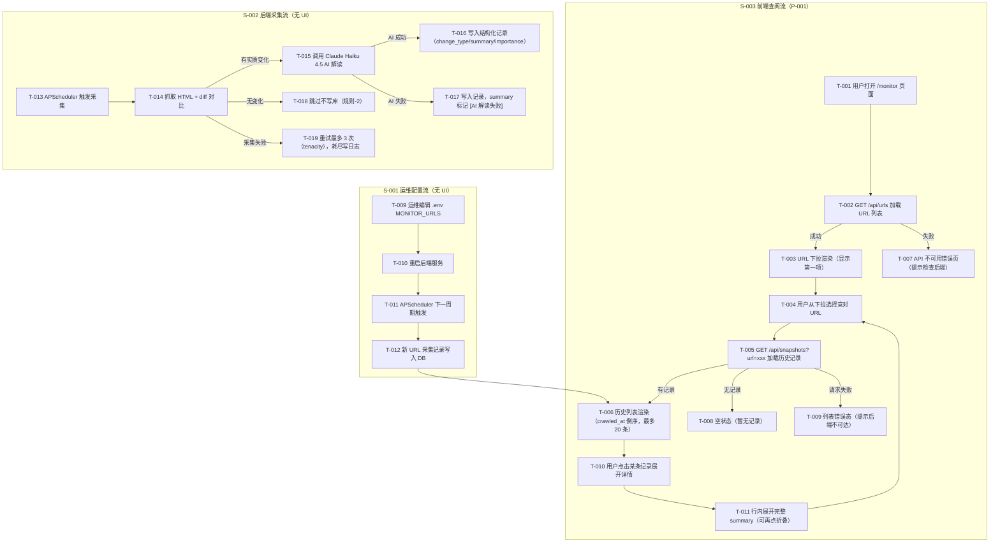

> 目的：把 `requirements/prd.md` 的核心场景/规则/AC，转写为可走查、可评审、可验证的交互说明，消除实现与验收歧义（不做视觉稿）。
>
> 规则：结论优先；只写会影响实现/验收的最小信息；本文档中不出现"待确认问题"清单——所有不确定性统一引用 PRD 的"验证清单"（V-xxx，Owner/截止/动作明确）。

## 0. 基本信息

- 需求标识（分支 / ID）：`001-competitor-tracking`
- 作者 / 参与评审：产品团队 / 开发 + 运维
- 状态：draft
- 最后更新：2026-07-07
- Figma 链接入口：无（MVP 阶段不做视觉稿）

---

## 1. 场景清单（与 PRD 对齐）

| 场景编号 | 场景标题（用户视角） | 成功标准 | 任务流节点 | 页面链路摘要 | PRD 对应 AC |
|---|---|---|---|---|---|
| S-001 | 运维配置监控目标（.env 驱动） | ① 新 URL 在下一周期出现采集记录；② 非法 URL 不影响其他正常采集；③ 无需开发介入 | T-009 → T-010 → T-011 → T-012 | 无 UI（backend .env 操作） → P-001 验证结果可见 | AC-001, AC-002, AC-003 |
| S-002 | 定时采集与 AI 解读（后端自动） | ① 无变化不写库；② 有变化 summary 非空；③ 失败重试最多 3 次且不影响其他 URL | T-013 → T-014 → T-015 / T-016 / T-017 / T-018 | 无 UI（纯后端） → 结果可在 P-001 查到 | AC-004, AC-005, AC-006, AC-007 |
| S-003 | 查阅历史记录 | ① ≤3 步找到目标竞对最近记录；② 单条展示 4 个字段；③ 2 分钟内完成查阅（V-003） | T-001 → T-002 → T-003 → T-004 → T-005 → T-006 → T-007 | P-001（主唯一页面） | AC-008, AC-009, AC-010 |

---

## 2. 端到端任务流

> 节点编号：T-001…；页面 P-001…（本需求仅一个前端页面）。
> S-001/S-002 为后端流程，节点仍编号以便 AC 追溯，但无对应前端页面。



---

## 3. 页面/弹窗清单

| Node ID | 类型 | 名称/目的 | 入口（从哪里来） | 覆盖任务流节点 | 覆盖场景 | 备注 |
|---|---|---|---|---|---|---|
| P-001 | P | /monitor 历史记录页 | 直接访问 URL / Vercel 部署根路由 | T-001 ~ T-011（S-003 全部） | S-003，间接呈现 S-001/S-002 结果 | MVP 唯一前端页面；无登录门槛（Out of scope） |

> 说明：S-001（.env 配置）和 S-002（后端采集）无前端页面，但其产出（数据库记录）通过 P-001 可验证。

---

## 4. 页面说明

### 4.1 P-001 /monitor 历史记录页

#### 4.1.1 入口与目的

- **ID**：P-001
- **页面目的**：展示各监控竞对 URL 的历史变化记录，支持按 URL 筛选 + 时间倒序列表 + 单条详情查看
- **入口**：直接访问 Vercel 部署的 `/monitor` 路由（Next.js 路由：`frontend/pages/monitor.tsx` 或 `app/monitor/page.tsx`）
- **前置条件**：
  - 后端 FastAPI 服务运行中，且 `NEXT_PUBLIC_API_BASE_URL` 环境变量已正确配置；若未配置，前端应展示"配置缺失"提示（异常-4，PRD §7）
  - 无登录鉴权要求（鉴权为 Out of scope，引用 PRD §2.1）
- **涉及场景**：S-003（主场景）；S-001、S-002 结果可通过本页验证

#### 4.1.2 ASCII 线框（必填）

```text
P-001 /monitor 历史记录页 — 正常态（有记录）
+--------------------------------------------------------------------+
| 竞争情报监控系统                                                   |
+====================================================================+
| 筛选竞对:  [  example.com (competitor-A)         v  ]              |
+--------------------------------------------------------------------+
| 历史变化记录                                         共 12 条      |
+--------------------+-----------+----------+------------------------+
| 采集时间           | 变化类型  | 重要程度 | 摘要                   |
+--------------------+-----------+----------+------------------------+
| 2026-07-07 14:30  | [内容更新] | [高]     | 产品定价页面新增 Ent.. |
+--------------------------------------------------------------------+
|   [展开详情 ▼]                                                     |
|   完整摘要：产品定价页面新增了 Enterprise 套餐入口，价格策略改为   |
|            "联系销售"模式，原有 Pro 套餐价格保持不变...           |
+--------------------------------------------------------------------+
| 2026-07-06 09:15  | [新增内容] | [中]     | 首页 banner 更换为新... |
| 2026-07-05 22:00  | [小幅变化] | [低]     | 页脚版权年份更新为 20.. |
|  ...（最多显示 20 条）                                             |
+--------------------------------------------------------------------+

--- 空状态（该 URL 无历史记录）---
+--------------------------------------------------------------------+
| 筛选竞对:  [  new-competitor.com                 v  ]              |
+--------------------------------------------------------------------+
|                   暂无该竞对的历史采集记录                         |
|              （后端将在下一个采集周期写入首条记录）                |
+--------------------------------------------------------------------+

--- 加载状态（列表加载中）---
+--------------------------------------------------------------------+
| 筛选竞对:  [  example.com                        v  ]              |
+--------------------------------------------------------------------+
|                         正在加载...                               |
+--------------------------------------------------------------------+

--- URL 下拉加载失败 / NEXT_PUBLIC_API_BASE_URL 未配置 ---
+--------------------------------------------------------------------+
| 竞争情报监控系统                                                   |
+====================================================================+
| [!] 无法连接到后端服务，请检查 NEXT_PUBLIC_API_BASE_URL 配置。     |
|     [重试]                                                         |
+--------------------------------------------------------------------+

--- URL 列表为空（MONITOR_URLS 未配置任何 URL）---
+--------------------------------------------------------------------+
| 筛选竞对:  （无可用竞对）                                          |
+--------------------------------------------------------------------+
|      暂无监控竞对，请在 .env 的 MONITOR_URLS 中配置目标网址        |
+--------------------------------------------------------------------+
```

#### 4.1.3 关键状态与反馈

| 状态 | 触发条件 | 界面要点 | 恢复路径 |
|---|---|---|---|
| 正常 | GET /api/urls 成功 + GET /api/snapshots 返回 ≥1 条记录 | URL 下拉显示全部 URL；列表按 crawled_at 倒序，最多 20 条；每行展示 4 个字段 | — |
| 加载中（列表） | 用户切换 URL 下拉，等待 /api/snapshots 响应 | 列表区域显示"正在加载…"；下拉仍可操作 | — |
| 加载中（URL 下拉） | 页面初始化，等待 GET /api/urls 响应 | 下拉显示"加载中…"，列表区域隐藏 | — |
| 空（无记录） | GET /api/snapshots 返回空列表 | 展示"暂无该竞对的历史采集记录" + 补充说明后端采集周期 | 用户等待下一个 MONITOR_INTERVAL 周期后刷新 |
| 空（无 URL） | GET /api/urls 返回空列表 | 展示"暂无监控竞对，请在 .env 中配置 MONITOR_URLS" | 运维配置 .env 并重启后端后页面刷新 |
| 错误（API 不可达） | GET /api/urls 请求失败（网络错误/5xx/CORS/URL 未配置） | 顶部 banner：「无法连接到后端服务，请检查 NEXT_PUBLIC_API_BASE_URL 配置」+ [重试] 按钮 | 点击"重试"重新发起请求；引用 PRD 异常-4 |
| 错误（列表请求失败） | GET /api/snapshots 请求失败 | 列表区展示"加载失败，请重试" + [重试] 按钮；URL 下拉不受影响 | 点击"重试"重新请求当前选中 URL 的记录 |
| 详情展开 | 用户点击某行的"展开详情 ▼" | 行内展开区域显示完整 summary（不截断）；其他行不受影响 | 再次点击"折叠 ▲"收起 |
| 无权限 | 不适用（MVP 阶段无鉴权，Out of scope，引用 PRD §2.1） | — | — |

#### 4.1.4 关键校验与错误处理

- **校验-1（NEXT_PUBLIC_API_BASE_URL 缺失）**：前端在发起 API 请求前检查该环境变量；若为空字符串则不发起请求，改为展示配置缺失 banner（PRD 异常-4：「NEXT_PUBLIC_API_BASE_URL 为空时，前端展示"配置缺失"提示」）
- **校验-2（crawled_at 时间格式）**：展示时统一格式化为 `YYYY-MM-DD HH:mm`（AC-009）；若后端返回的时间字段格式异常，展示原始值，不阻断渲染
- **校验-3（summary 截断）**：列表行的 summary 截断至 200 字并追加省略号；展开详情后展示完整文本（AC-009）
- **校验-4（importance 枚举显示）**：`importance` 字段值映射为中文标签"低 / 中 / 高"；若返回未知值则原样展示（不报错）

#### 4.1.5 跳转与交互

- **URL 下拉切换**：选中新 URL 后，立即发起 GET /api/snapshots?url={encodedUrl}，列表进入加载状态，加载完成后刷新列表区域；URL 下拉始终可操作（不锁定）
- **展开详情**：点击行上的"展开详情 ▼"按钮，行内展开完整 summary；同一时间允许多条同时展开（无互斥限制）
- **折叠详情**：点击"折叠 ▲"还原行高；其他行状态不变
- **重试**：点击"重试"按钮，重新发起对应失败的 API 请求（GET /api/urls 或 GET /api/snapshots）
- **取消/关闭/返回**：页面无跳转路由（单页），无二次确认需求（只读页面，无不可逆操作）
- **页面刷新**：刷新后重新从步骤 T-001 开始，URL 下拉默认选中第一项（与初始加载一致）

---

## 5. AC → 交互节点映射

| AC-ID / 描述 | 场景 | 任务流节点 | 页面/节点 | 验证点 |
|---|---|---|---|---|
| AC-001：新 URL 配置后下一周期出现采集记录 | S-001 | T-009 → T-012 → T-006 | P-001（列表） | 在 URL 下拉中选择新配置的 URL，等待一个 MONITOR_INTERVAL 后，列表出现 ≥1 条记录 |
| AC-002：非法 URL 后端日志报错，其他 URL 不受影响 | S-001 | T-009 → T-011 | 无前端页面（验证后端日志）；P-001 验证其他 URL 仍有记录 | 在 P-001 选择其他正常 URL，列表正常渲染；后端日志包含非法 URL 的错误信息 |
| AC-003：非开发人员按文档独立完成新增 URL 操作 | S-001 | T-009 → T-012 | 无前端页面（运维操作验证，引用 V-004） | 运维按文档操作，AC-001 验证通过即可确认（V-004 Owner：开发+运维，截止：内测第 1 周） |
| AC-004：无变化不新增记录 | S-002 | T-014 → T-018 | P-001（列表） | 目标页面无内容变化时，列表中同一 URL 最新记录的 crawled_at 不变 |
| AC-005：有变化时 change_type 非空，summary 为可读中文 | S-002 | T-015 → T-016 | P-001（列表 + 详情展开） | 列表行的 change_type 标签非空；展开详情后 summary 为可读中文句子，引用 V-001 |
| AC-006：单 URL 采集超时后自动重试最多 3 次，不影响其他 URL | S-002 | T-019 | 无前端页面（验证后端日志）；P-001 验证其他 URL 仍有记录 | 制造某 URL 超时场景，后端日志记录 3 次重试；P-001 其他 URL 列表正常更新 |
| AC-007：7 天连续运行整体采集成功率 >90% | S-002 | T-013 ~ T-019 | 无前端页面（后端统计，引用 V-002） | 统计数据库记录数与预期触发次数之比；验证截止：内测第 2 周 |
| AC-008：URL 下拉包含全部监控 URL；选中后显示按 crawled_at 倒序列表 | S-003 | T-002 → T-003 → T-004 → T-006 | P-001（下拉 + 列表） | ① 下拉选项数 = MONITOR_URLS 配置的 URL 数；② 切换 URL 后列表第一条的 crawled_at 为最新 |
| AC-009：单条记录展示 4 个字段（crawled_at/change_type/summary/importance） | S-003 | T-006 | P-001（列表行） | 列表每行展示：时间（YYYY-MM-DD HH:mm）、change_type 标签、summary（截断 200 字）、importance 标签 |
| AC-010：≤3 步找到目标竞对最近一条记录 | S-003 | T-001 → T-003 → T-006 | P-001 | 步骤：① 打开 /monitor → ② 从下拉选择目标 URL → ③ 查看列表第一条；引用 V-003（2 分钟内完成） |

---

## 6. 走查/验证脚本

### 6.1 覆盖的验证清单条目（引用 prd.md §8）

- **V-001**：Haiku 4.5 AI 解读质量（验证信号：80%+ 变化正确识别，summary 有参考价值；Owner：开发+PM；截止：内测第 1 周）
- **V-002**：定时采集稳定性 >90%（7 天连续运行统计；Owner：开发；截止：内测第 2 周）
- **V-003**：前端用户体验（2 分钟内完成查阅任务；Owner：PM；截止：内测第 2 周）
- **V-004**：.env 配置可维护性（非开发人员独立完成；Owner：开发+运维；截止：内测第 1 周）

### 6.2 任务脚本（按场景）

---

**任务-1（S-003：查阅历史记录走查）**

- **任务目标**：验证内部用户可在 2 分钟内完成"找到某竞对近 7 天变化"的查阅，且 ≤3 步（对应 V-003、AC-008、AC-009、AC-010）
- **前提**：后端已运行 ≥1 个采集周期，数据库中至少 2 个 URL 有采集记录
- **关键步骤（引用节点）**：
  1. 打开 Vercel 部署的 /monitor 页面（T-001）
  2. 等待 URL 下拉加载完成（T-002 → T-003），确认下拉包含全部配置的 URL
  3. 从下拉选择目标竞对 URL（T-004），等待列表加载（T-005 → T-006）
  4. 确认列表按 crawled_at 倒序排列，首条为最新记录
  5. 确认首条记录展示 4 个字段：采集时间（YYYY-MM-DD HH:mm）、change_type 标签、summary（≤200 字）、importance 标签
  6. 点击"展开详情"查看完整 summary（T-010 → T-011）
  7. 记录总操作步骤数（预期 ≤3 步）和总耗时（预期 <2 分钟）
- **成功标准**：
  - ① URL 下拉数 = MONITOR_URLS 数量；② 列表倒序正确；③ 4 个字段全部展示；④ ≤3 步；⑤ 总耗时 <2 分钟
- **观察点/记录项**：
  - 列表加载耗时（>2s 需优化）
  - summary 截断是否影响信息完整性
  - 空状态是否有明确引导（等待下一采集周期）
  - change_type 值的可读性（如"内容更新"是否清晰）

---

**任务-2（S-001：运维配置新增 URL）**

- **任务目标**：验证运维人员无需开发介入，可独立新增监控 URL（对应 V-004、AC-001、AC-003）
- **前提**：后端服务已部署，运维拥有服务器 .env 文件访问权限
- **关键步骤（引用节点）**：
  1. 运维编辑服务器 .env 文件，在 MONITOR_URLS 中追加新目标 URL（T-009）
  2. 重启后端服务（T-010）
  3. 等待一个 MONITOR_INTERVAL 周期
  4. 打开 /monitor，在 URL 下拉中选择新增的 URL（T-001 → T-004）
  5. 确认列表中出现 ≥1 条采集记录（T-006），记录 crawled_at 时间与预期周期误差
- **成功标准**：
  - ① 新 URL 在下拉中可见；② 列表出现采集记录；③ 操作全程无需开发介入
- **观察点/记录项**：
  - 重启到首次采集的实际耗时
  - .env 文档清晰度（是否需要补充说明）

---

**任务-3（S-002：AI 解读质量抽检）**

- **任务目标**：验证 AI 解读质量（对应 V-001、AC-005）
- **前提**：数据库中已有 ≥3 个"有实质变化"的采集记录（change_type 非空）
- **关键步骤（引用节点）**：
  1. 人工选取 3–5 个已知发生变化的页面记录（可通过 P-001 列表找到）
  2. 展开详情查看完整 summary（T-010 → T-011）
  3. 对比 summary 与实际页面变化内容，判断识别准确性
  4. 标记"正确识别 / 部分正确 / 误判 / 漏检"，计算正确识别率
- **成功标准**：正确识别率 ≥80%（V-001 信号）
- **观察点/记录项**：
  - 误判类型（误判有变化 / 漏检变化 / summary 语义不准确）
  - 不达标触发动作：升级至 Sonnet 4.6 或调整 prompt 策略（PRD §8 V-001）

---

### 6.3 记录方式（问题清单模板）

| 问题 | 严重度（S1/S2/S3） | 复现步骤 | 影响范围（场景/页面/AC） | 建议修复方向 |
|---|---|---|---|---|
|  |  |  |  |  |

> S1：阻断验收（功能失效）；S2：影响用户体验（有 workaround）；S3：优化项

### 6.4 结论与回流

- **结论摘要**：（走查完成后填写）
- **需要回流更新的文件**：
  - `requirements/solution.md`（若 V-001/V-002 验证结果影响方案边界，如升级模型或引入代理池）
  - `requirements/prd.md`（若 AC 描述不够精确或发现缺失场景）
  - `requirements/prototype.md`（若交互细节需要调整，如展开详情的交互方式、字段展示优先级）
- **何种问题回流 R1/R2**：
  - 发现超出当前 Out-of-scope 边界的新需求（如用户要求搜索、标注）→ 回流 R1（raw 补录）
  - AC 描述存在歧义导致实现不一致 → 回流 R2（prd.md 修正）
  - 交互细节不满足用户需求 → 回流 R3（prototype.md 修正）

---

## 7. 追溯链接

- **PRD**：`requirements/prd.md`（§3 场景、§6 AC、§7 异常、§8 验证清单、§9 原型分流结论）
- **Solution**：`requirements/solution.md`（§2 推荐方案与边界取舍、§3 验证清单 V-001~V-004）
- **Raw**：`requirements/raw.md`（第 1–7 轮澄清记录：技术栈/字段/配置管理/功能扩展决策）
- **术语与口径**：无（`project/memory/glossary.md` 不存在，CONTEXT GAP，不阻断）

---

## 8. R3-DoD 自检

- [x] 交互内容与 PRD 的场景/规则/AC 一一对应（§1 场景清单与 PRD §3/§6 对齐）
- [x] 任务流、节点清单与页面清单一致（§2 Mermaid 节点 T-001~T-019；§3 页面清单 P-001；§5 AC 映射全覆盖）
- [x] 每个页面至少包含：入口、ASCII 线框、状态、跳转（§4.1 完整填写）
- [x] 关键状态覆盖完整（§4.1.3：正常/加载/空/错误；详情展开/折叠；无权限标注为 Out of scope）
- [x] 无不可逆高风险操作（只读页面，无需二次确认策略）
- [x] 与 PRD 的 AC 可追溯（§5 AC→交互节点映射，10 条 AC 全部覆盖）
- [x] 走查/验证脚本已包含 3 个任务脚本与回流指引（§6）
